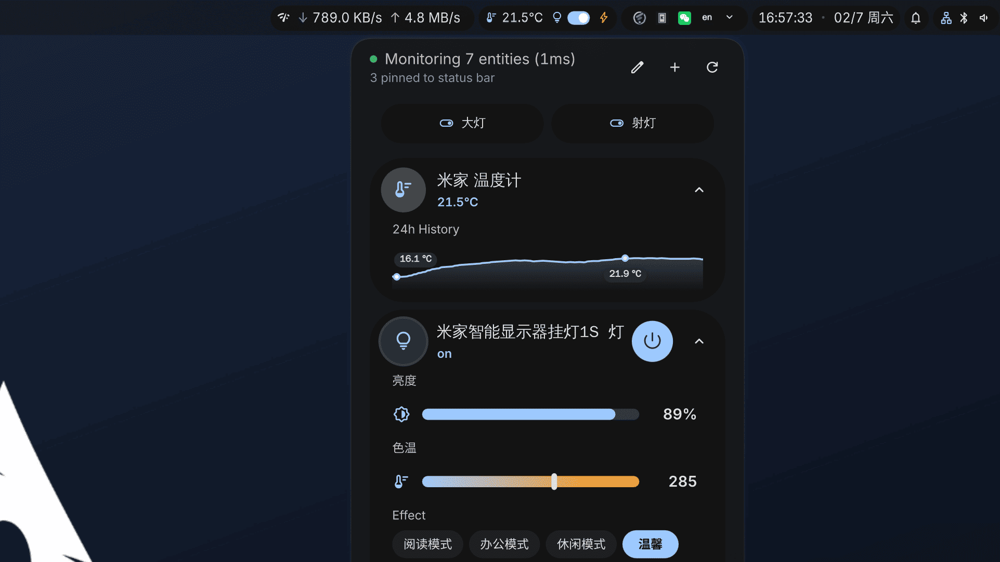

# Home Assistant Monitor for DankMaterialShell

Monitor and control your Home Assistant entities directly from your status bar.

## Features

- **Real-time Monitoring**: WebSocket-based updates for instant state changes.
- **Entity Controls**: Toggle lights, switches, locks, covers, fans, and more.
- **Quick Actions**: Pin entities to the status bar or create top-level shortcut buttons.
- **Editing Mode**: Sort, rename (double-click), and manage shortcuts easily.
- **Browser**: Built-in entity browser to find and add devices.

## Requirements

- **System Package**: `qt6-websockets` is required for operation.
- **Home Assistant WebSocket API**: Must be accessible (usually enabled by default).
- Long-lived access token.

## Configuration

1. Go to Plugin Settings.
2. Enter your **Home Assistant URL** (e.g., `http://homeassistant.local:8123`).
3. Enter your **Long-Lived Access Token**.

## Permissions

- `settings_read` / `settings_write`

## Feedback & Contributions

Suggestions for improvements and feature requests are always welcome.  
If you have ideas, encounter issues, or want to see new features, feel free to open an issue or submit a pull request.
